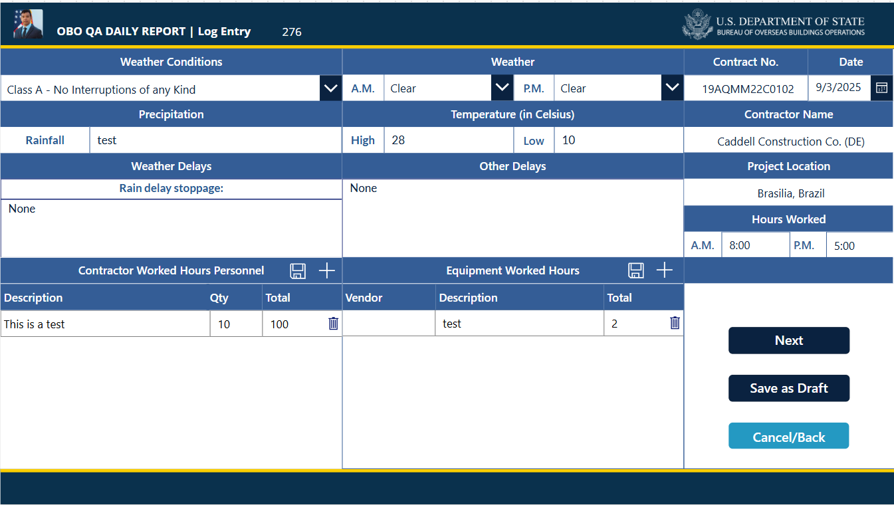
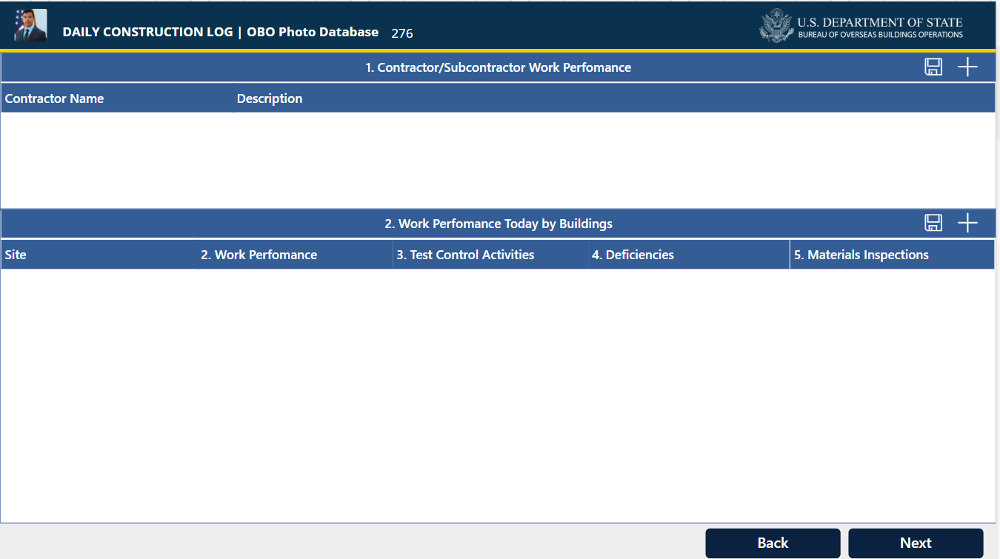
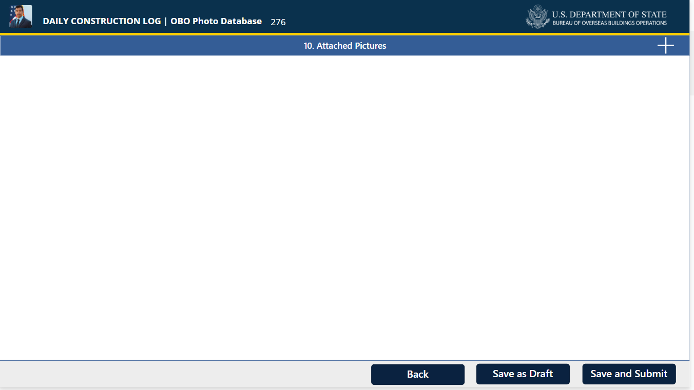
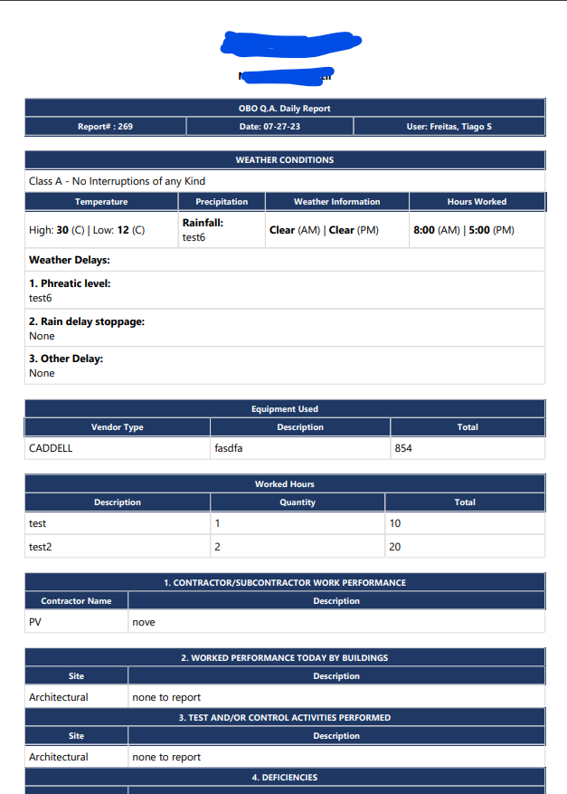

# 🏗️ Construction QA Daily Report App (Power Apps)

## 📄 Overview

The **Construction QA Daily Report App** is a custom-built Power Apps solution designed for field supervisors, QA auditors, and construction managers to submit **daily site reports** directly from their mobile or desktop devices.

Each report captures weather conditions, contractor work hours, equipment usage, delays, material inspections, safety findings, and attached site photos — all consolidated and generated into a **PDF report** upon submission.

---

## 🧩 Key Features

- 📋 Structured multi-section daily report form
- 🌤️ Weather logging (conditions, delays, temperatures)
- 👷 Contractor and subcontractor performance tracking
- 🏗️ Site work inspections by discipline (Electrical, Mechanical, Welding, Civil, etc.)
- 🧾 Automatic PDF report generation after submission
- 🖼️ Photo attachment support for field documentation
- 🕒 Logging of worked hours per contractor/equipment
- ✅ Built for both mobile and desktop environments

---

## 📸 Screenshots

| Weather and Work Logs                     | QA & Subcontractor Input                      | Work Performance Form               |
| ----------------------------------------- | --------------------------------------------- | ----------------------------------- |
|  |  |  |

|  Photo Attachment                           | PDF Page 1                                | PDF Page 1                                |
| ------------------------------------------- | ----------------------------------------- | ----------------------------------------- |
|  | | |

---

## 🚀 How to Use

1. **Open the app** in Power Apps (Canvas App)
2. Fill in daily sections:
   - Weather & Delays
   - Contractor Hours
   - Equipment Usage
   - QA Inspections
   - Safety Evaluations
3. Add photos or additional notes as needed
4. Click **Submit** to save the record and trigger PDF generation

> 📤 PDF is auto-generated and optionally sent to a document library or via email.

---

## 📂 Project Structure

```text
construction-daily-report-app/
├── README.md
├── Microsoft.PowerApps/
│   └── DailyReport.msapp
├── docs/
│   └── screenshots/
│       ├── AttachedPictures.png
│       ├── GenInfoPage.png
│       ├── MainPageApp.png
│       ├── PDF_Page1.png
│       ├── PDFPag2.png
│       ├── SubmitalsReviewPage.png
│       └── WorkPerfomancePage.png
```
